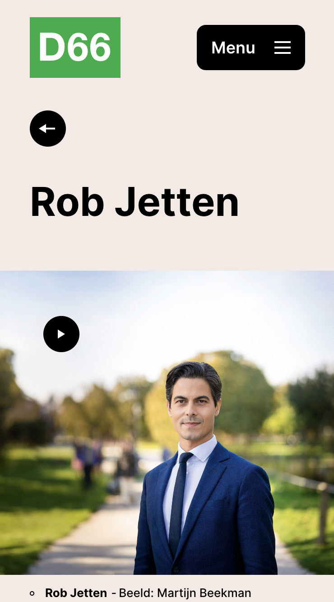
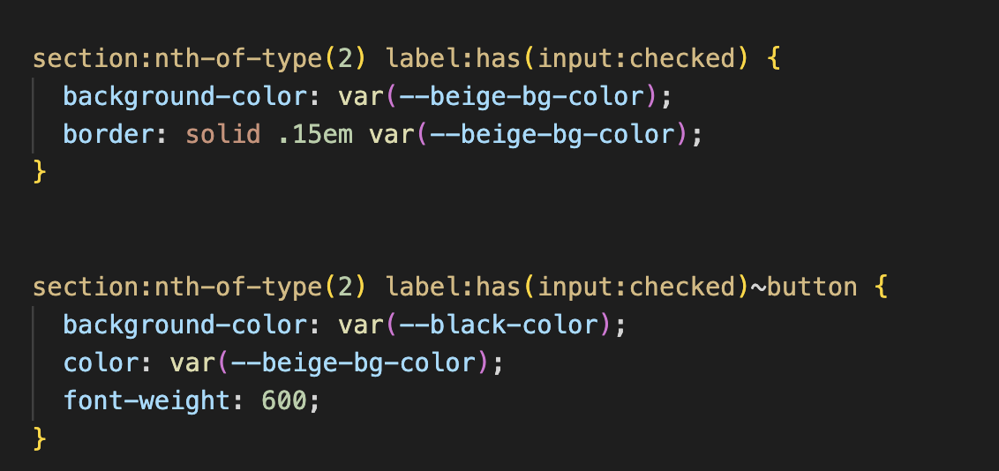

# Procesverslag
Markdown is een simpele manier om HTML te schrijven.  
Markdown cheat cheet: [Hulp bij het schrijven van Markdown](https://github.com/adam-p/markdown-here/wiki/Markdown-Cheatsheet).

Nb. De standaardstructuur en de spartaanse opmaak van de README.md zijn helemaal prima. Het gaat om de inhoud van je procesverslag. Besteedt de tijd voor pracht en praal aan je website.

Nb. Door *open* toe te voegen aan een *details* element kun je deze standaard open zetten. Fijn om dat steeds voor de relevante stuk(ken) te doen.

## Jij

  
uitwerken voor kick-off werkgroep

  ### Auteur:
  Kaylin Noëlla Bartelings

  #### Je startniveau:
  Blauw/rood

  #### Je focus:
  Ik wil mij foccusen op de surface plane. De reden hiervoor is omdat ik graag in de toekomst aan de slag wil gaan als digital designer en daarvoor wil ik graag wat meer kennis over codes hebben op het gebied van wat er allemaal mogelijk is qua surface. Dit zal mij in de toekomst helpen met het communiceren met developers

## Je website

  
uitwerken voor kick-off werkgroep

  ### Je opdracht:
  https://web.archive.org/web/20231119202924/https://d66.nl/#https://web.archive.org/web/20231119202924/https://d66.nl/# 
  #### Screenshot(s) van de eerste pagina (small screen): 
  hier de naam van de pagina  
  

  #### Screenshot(s) van de tweede pagina (small screen):
  hier de naam van de pagina  
  
 

## Toegankelijkheidstest 1/2 (week 1)

  
uitwerken na test in 2e werkgroep

  ### Bevindingen
  Een van de belangerijkste bevindingen was dat de site ten eerste erg inconsistent is met het stylen van links en buttons. linken zien er soms uit als buttons en soms zien buttons eruit als linkjes. 

  Ook gebruikt de site van d66 niet overal een h1 element en gebruiken zij veel divs. ze gebruiken niet altijd ul en li tags voor lijsten.

## Breakdownschets (week 1)

  
uitwerken na afloop 3e werkgroep

  ### de hele pagina: 
  

  ### dynamisch deel (bijv menu): 
  

## Voortgang 1 (week 2)

  
uitwerken voor 1e voortgang

  ### Stand van zaken
  Het selecteren van een site die ik wilde nabouwen vergde wat tijd, aangezien ik een "mooie" site wilde kiezen. Mijn initiële overweging was om een website te kiezen die bekroond was met een Awwward, maar deze bleken vaak te complex voor mijn vaardigheidsniveau. Niettemin vond ik het belangerijk en leuk om een site te kiezen waarmee ik creatief kon omgaan met de surface plane, omdat ik mijn expertise op dat gebied wil uitbreiden.

  Wat betreft de voortgang in het schrijven van semantisch correcte code, ben ik tot nu toe tevreden. Ik leer steeds nieuwe en verbeterde manieren om code op een correcte manier te structureren en te schrijven. Het leren van op een nieuwe manier is uitdagend maar ik denk wel veel te leren over toegankelijkheid.

  Het belang van semantisch correcte code wordt steeds duidelijker voor mij, omdat het ervoor zorgt dat de website niet alleen visueel aantrekkelijk is, maar ook begrijpelijk voor verschillende gebruikers, inclusief degenen die afhankelijk zijn van schermlezers of andere hulpmiddelen voor toegankelijkheid.

  ### Agenda voor meeting
  samen met je groepje opstellen

  | Kaylin Noella Bartelings 
  |semantische correct geschreven html code

  |Sander
  |semantische correct geschreven html code

  |Diya
  |semantische correct geschreven html code

  |Insa
  |semantische correct geschreven html code

  ### Verslag van meeting
  Tijdens deze eerste feedback sessie was er nog relatief weinig om concreet feedback op te geven dan enkel over de html, sanne gaf aan dat mijn html redelijk goed en semantisch geschreven was. Wel adviseerde hij gebruik te maken van aria-labels om het zo voor mensen met een beperking en screen reader makkelijker te maken. Ik had goed gebruik maakt van de bestaande html tags maar moest alle alts nog wel invullen.

## Voortgang 2 (week 3)

  
uitwerken voor 2e voortgang

  ### Stand van zaken
  De afgelopen week heb ik De afgelopen week heb ik mij gefocust op het optimaliseren van de HTML- en CSS-code. Ik heb me specifiek gericht op het gebruik van semantisch correcte HTML om de structuur van de website te verbeteren en ervoor te zorgen dat deze goed wordt geïnterpreteerd door screenreaders.
  
  Daarnaast heb ik me beziggehouden met het implementeren van JavaScript-functionaliteiten. Een van de functies die ik heb toegevoegd, is het dynamisch veranderen van achtergrondkleuren van secties op basis van scrollen. Ook heb ik een slider gemaakt.

  Wat betreft CSS heb ik me gericht op optimalisatie om een schone en efficiënte codebasis te behouden. Ik heb aandacht besteed aan het vermijden van herhalingen en het gebruik van selectoren om de styling van de website en mijn kennis van css te verbeteren.

  Ik zou nog graag mijn css schoner willen coderen om herhaling te voorkomen, ik zou graag classes willen gebruiken maar ik ben mij ervan bewust dat dat niet altijd de beste oplossing is. ik leer te werken met nieuwe selectoren.

  Ook heb ik geleerd om te stylen met ::before en ::after en te werken met en accordions met de html tages detail en summary. Op de pagina van D66 hebben zij een accordions met een button waar een plusje in staat als hij ingeplakt is en een min als hij uitgeklapt is. Normaal gesproken zou ik hier een image of een span voor gebruiken maar Sanne legde uit in de les dat ik hier ook een ::after voor kon gebruiken. ik had wel eens met ::after en ::before gewerkt maar niet vaak dus hij legde mij uit hoe ik dit het beste kon doen en ik heb hier veel van geleerd en vervolgens ook voor de button in mijn footer gebruikt die vervolgens met javascript in en uitklapt.

  ### Agenda voor meeting
  samen met je groepje opstellen

  | Kaylin Noella Bartelings 
  css optimaliseren
  filter
  semantiek 
  Hero, hamburger en images

  |Sander
  css optimaliseren
  filter
  semantiek 
  Hero, hamburger en images

  |Diya
  css optimaliseren
  filter
  semantiek 
  Hero, hamburger en images

  |Insa
  css optimaliseren
  filter
  semantiek 
  Hero, hamburger en images

  ### Verslag van meeting
  Deze week had ik zelf niet heel veel vragen voor tijdens de feedback sessie, ik had de meeste dingen waar ik tegen aan liep of al zelf op kunnen lossen doormiddel van googelen, vragen aan medestudenten of door het aan sanne te vragen in de les. wel liep ik tegen een puntje aan dat ik niet wist hoe ik de labels in een input veld kon laten vergoten en verkleinen als er een focus is. Ik had dit gevraagd aan de student assisent tijdens de feedback sessie en hij gaf aan dat ik sowiso met :focus moest werken maar hoe het verder werkte met het schalen van het label was nog niet helemaal duidelijk voor ons beide. (ik besloot dit op te schrijven en later zelf te googelen of aan sanne te vragen)

  Verder gaf hij aan dat mijn html er semantisch goed uit zag maar mijn css misschien nog wat cleaner kon door bijv. margins en paddings op te nemen als variabel in mijn :root. 

## Toegankelijkheidstest 2/2 (week 4)

  
uitwerken na test in 9e werkgroep

  ### Bevindingen
  Met de tweede test ben ik mijn eigen site gaan testen, uit de test kwam dat ik wel gebruik maakte van het H1 element per pagina, mijn video speelt niet automatisch af en is te bedienen en op pauze te zetten dus dat is postief. Ik gebruik voor linkjes a elementen. De site heeft geen horizontale scroll en elke slider is te bedienen met buttons. Alle images hebben alt's.

  Ook maakte de orginele site van d66 niet goed gebruik van heading elementen en is mijn site semantischer opgebouwd en maakt maar gebruik van 1 div. Ik heb styling voor buttons en voor links gescheiden gehouden en niet overgenomen van de site omdat hun inconsisent waren.

## Voortgang 3 (week 4)

  
uitwerken voor 3e voortgang

  ### Stand van zaken
  Deze week ben ik aan de slag gegaan met het coderen van de tweede pagina, hier staan elementen als video en accordions op.

  ik heb me gericht op het coderen van de footer voor de website. Een goed ontworpen footer is essentieel voor het verstrekken van belangrijke informatie en navigatiemogelijkheden. Hierbij heb ik geprobeerd mijn code schoon en efficiënt te houden.

  Omdat ik surfaceplane heb gekozen heb ik een video toegevoegd aan mijn site. om ervoor te zorgen dat mijn site nog steeds toeganekelijk is is het voor mij belangerijk dat de video niet gelijk afspeelt en dat hij te bedienen is.

  Verder heb ik mij gefocust op het testen van hoe toegankelijk mijn site was, en ben ik met een screen reader door kopjes gegaan en dit werkte allemaal.

  ### Agenda voor meeting

  | Kaylin Noella Bartelings 
  css optimaliseren
  semantiek 
  Form en labels

  | Sander
  css optimaliseren
  semantiek 
  Form en labels

  | Insa
  css optimaliseren
  semantiek 
  Form en labels

 | Diya
  css optimaliseren
  semantiek 
  Form en labels

  ### Verslag van meeting
  Aangezien mijn vraag tijdens de vorige feedback sessie niet volledig beantwoord kon worden vroeg ik de vraag tijdens deze laatste feedback sessie opnieuw aan Sanne, hij heeft een voorbeeld in codepen gemaakt terwijl ik meeschreef in mijn eigen code. Sanne legte uit dat :has hiervoor handig was omdat :has controleert of een element een bepaalde eigenschap bezit, als dat het geval is dan zal hij de codes en styling uitvoeren. Ik heb has eerder gebruikt op advies van Sanne dus ik wist inmiddes wat de functie van :has voor was maar ik heb er nog niet vaak mee gewerkt dus ik had niet gelijk door dat ik :has hiervoor kon gebruiken. 

  Ook had ik een vraag over een semantisch puntje in mijn footer. Ik had namelijk een section aangemaakt in mijn footer en ik wist niet helemaal zeker of dit oke was maar volgens sanne was dit juist goed omdat het dan voor screenreaders makkelijk was.

## Eindgesprek (week 5)

  
uitwerken voor eindgesprek

  ### Je uitkomst - karakteristiek screenshots:
  
  
  

  ### Dit ging goed/Heb ik geleerd: 
  Ik heb geleerd om te werken met ::after. Voor de footer en accordions heb ik buttons die open en dichtklappen als je erop klikt. als het open is heeft de button een min, als het dicht is een plusje. normaal zou ik dit doen met een img maar sanne heeft mij geleerd dat dit mogelijk is met ::after en dat dit gewoon het zelfde werkt als stylen van andere elementen. 

  

  Ook heb ik geleerd te werken met dubbele forms achter elkaar, de site vraagt de gebruiker een vraag en aan de hand van die keuze wordt de gebruiker door gestuurd naar een volgend form maar de geberuiker blijft op dezelfde pagina. dit betekent dat er twee forms zijn waarvan er een verborgen moet zijn en te voorschijn moet komen als de andere bantwoord is. ik had dit nog nooit gedaan dus dit is zeker iets wat ik geleerd heb. 
  
  

   ook hier werk ik voor het tweede form weer met has. als de gebruiker een label heeft aangeklikt kleurt deze als bevestiging dat hij is aangeklikt.

  

  Ik heb geleerd hoe ik in css een darkmode maak, ik heb hier nog nooit eerder meegewerkt dus dit was nieuw voor mij. Het bleek helemaal niet zo heen ingewikkeld te zijn en door custom properties kan je dit heel snel aanpassen.

  

  ### Dit was lastig/Is niet gelukt:
  Ik wilde werken met een veranderde achtergrond op basis van scroll, ik zie dit namelijk veel bij awwward sites en wilde graag dit zelf een keer toepassen en progammeren. Ik had hier nog nooit meegewerkt dus ik wist niet zo goed hoe en waar ik moest beginnen. Na wat uitleg en codes van sanne begreep ik een beetje hoe en wat. zelf zou ik niet uit mijn hoofd deze code geschreven kunnen hebben. Maar na de uitleg begreep ik in grote lijnen wel wat er stond en werkte het.
  

  Op de site van D66 werken zij met een slider die te bedienen is met buttons, ik heb hiervoor met behulp van chatgpt een slider function gemaakt in JavaScript. Ik ben zelf niet goed met javascript dus ik heb chatgpt gevraagd om mij hierbij te helpen. Chatgpt schrijft een stuk geavanceerdere codes dan ik kan schrijven en zelfs kan lezen dus ik heb Jake en Sanne gevraagd mee te kijken en uitleg te geven over wat er staat en heb hierdoor nieuwe dingen geleerd zoals wat een % is. een % is een modulo, dit kijkt naar hoevaak het getal in het hele past, dat wat over blijft is de modulo. ook heb ik geleerd dat => een nieuwe manier van functies schrijven is.

  

  De slider wordt op meerdere plekken gebruikt, in principe zou ik dus 1 functie kunnen schrijven voor alle sliders, sanne gaf aan dat dit bijv kan doormiddel van een object bijv. 

  Ook schuift de slider helemaal op als ik met de screenreader erdoor heen tab met de screenreader, ik heb met sanne overlegt hoe ik dit zou kunnen oplossen maar dit zou erg omslachtig zijn en ik wil niet aan de slag als developer dus hij adviseerde mij hier niet al te veel over in te zitten.

  

  Daarnaast heb ik geprobeerd een hoog contrast mode te maken, deze is gelukt maar hier ben ik niet geheel tevreden over, ik vind het lastig om te kijken welke keuren ik hiervoor moet gebruiken en dit goed toe te passen. hier valt voor mij zeker nog veel te leren, niet alleen voor het schrijven van codes want ik weet nu hoe de codes voor hoog contrast werken maar meer als designer hoe ik om moet gaan met deze beperking.

  

## Bronnenlijst

  
continu bijhouden terwijl je werkt

  1. Inspiratie voorbeeld voor intersecting 
  https://codepen.io/daveredfern/pen/zBGBJV

  2. Website voor het omrekenen van px to em
  https://www.w3schools.com/tags/ref_pxtoemconversion.asp

  3. Code voor class="visually-hidden" gebruik om elementen die er wel zijn maar niet getoond hoeven te worden te verbergen. Voor screenreaders moeten ze er wel zijn maar visueel niet.
  https://www.a11yproject.com/posts/how-to-hide-content/

  4. Gebruik van chatgpt voor het schrijven van de slider function in javascript 
  https://chat.openai.com

  5. Code en uitleg voor Detail en Summary 
  https://developer.mozilla.org/en-US/docs/Web/HTML/Element/details

  6. Code en uitleg voor het gebruik van fieldsets 
  https://developer.mozilla.org/en-US/docs/Web/HTML/Element/fieldset

  7. JavaScript codes voor intersecting function
  Hooft, M.S. t 

